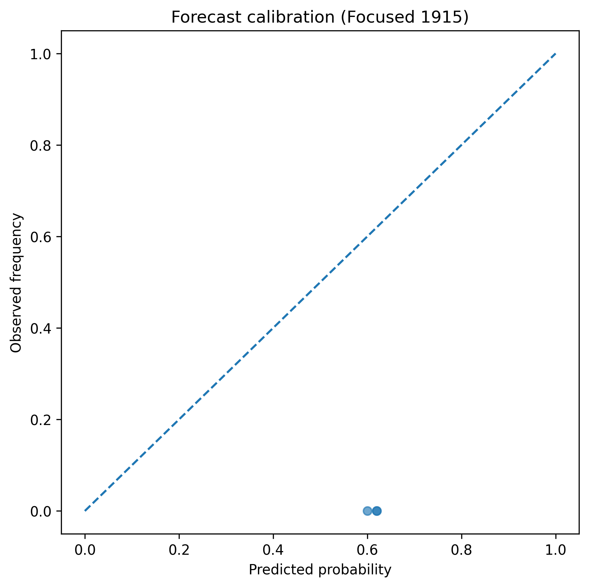
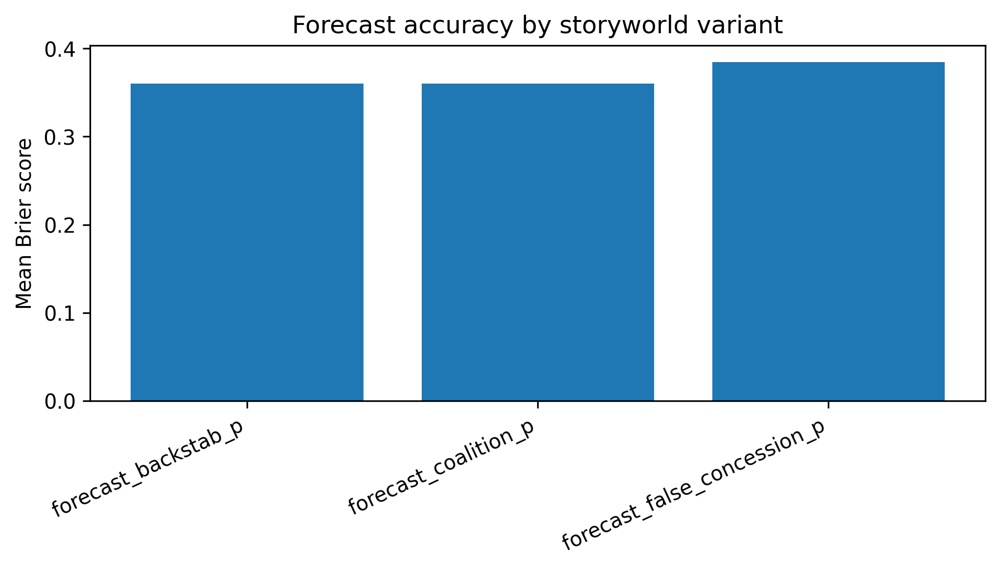
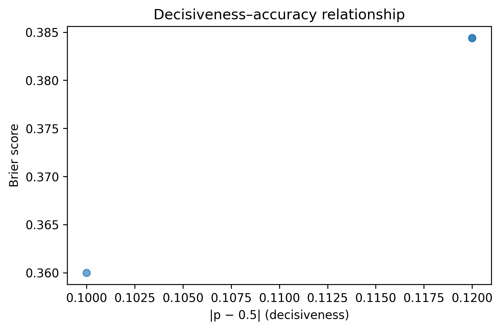
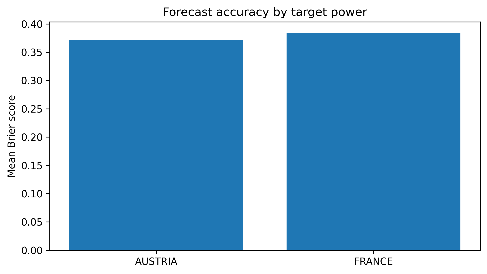

# pValue Storyworlds for Multi-Agent Diplomacy: Layered Forecasting Toward Form-Fit Scenarios (Draft)

**Author:** Working draft for ongoing AI_Diplomacy program  
**Date:** 2026-02-06  
**Status:** Stub for weekend/Monday expansion

## Abstract

We report early results from a pValue/p2Value-augmented multi-agent Diplomacy workflow in which agents use compact storyworlds as reasoning scaffolds for coalition and defection forecasting. Across five focused 1915 runs, we observe stable confidence calibration (`mean confidence = 0.60`) with improving forecast accuracy in later layered scenarios (`best mean Brier = 0.2963` on 2026-02-06). The current evidence suggests that increasingly layered storyworlds can improve action-forecast quality when they are tightly matched to the active strategic dilemma ("form-fit" storyworld selection).

## 1. Problem Statement

Classical Diplomacy agents optimize local utility under adversarial uncertainty, but often under-model recursive social beliefs. We introduce a p-manifold framing where:

- `pValue` terms capture first-order beliefs (A's perceived value of B).
- `p2Value` terms capture second-order beliefs (A's belief about B's belief regarding A or C).

We test whether adding these dimensions through storyworld prompts improves negotiation forecasting and coalition stability reasoning.

## 2. p-Manifold Formalization (Working)

Let each agent `i` have latent strategic state `x_i` and belief fibers over other agents:

$$
M_i = x_i \oplus \bigoplus_{j \neq i} p_{ij} \oplus \bigoplus_{j \neq i, k \neq i,j} p^2_{ijk}.
$$

For a forecast event `e` (e.g., near-term aggression), the current scoring objective is Brier minimization:

$$
\text{Brier}(\hat p, y) = (\hat p - y)^2, \quad y \in \{0,1\}.
$$

Storyworld desirability scripts inject pValue and p2Value evidence into choice preference updates, approximating:

$$
U_i(a) = U^0_i(a) + \lambda_1\,p_{ij} + \lambda_2\,p_{ji} + \lambda_3\,p^2_{ijk}.
$$

## 3. Experimental Setup

Data source: `https://github.com/patrickdugan/AI_Diplomacy/tree/main/results/focused_1915_pvalue_*`  
Window: 2026-02-05 to 2026-02-06  
Runs analyzed: 5

Tracked artifacts per run include:

- `storyworld_forecasts.jsonl`
- `forecast_scores.jsonl`
- `storyworld_impact.jsonl`
- `reasoning_diary.jsonl`
- `storyworld_play_steps.jsonl`
- `storyworld_play_reasoning_steps.jsonl`

Aggregate counts over all 5 runs:

- Forecast records: `20`
- Explicit impact records: `20`
- Play steps: `70`
- Reasoning-over-play steps: `67`
- Negotiation diary signal rows: `24 / 56`

## 4. Layered Storyworld Progression

We observe a succession from simpler forecast framings (coalition/defection) to higher-layer manipulation framing (false concession), followed by a best-performing mixed run.

| Run ID | Date/Time | Forecasts | Mean Confidence | Mean Brier | Storyworld Mix |
|---|---:|---:|---:|---:|---|
| focused_1915_pvalue_20260205_233410 | 2026-02-05 23:34:10 | 3 | 0.60 | 0.3600 | coalition+defection |
| focused_1915_pvalue_20260205_233554 | 2026-02-05 23:35:54 | 3 | 0.60 | 0.3600 | coalition+defection |
| focused_1915_pvalue_20260206_000333 | 2026-02-06 00:03:33 | 2 | 0.60 | 0.3600 | coalition+backstab |
| focused_1915_pvalue_20260206_000643 | 2026-02-06 00:06:43 | 6 | 0.60 | 0.3763 | false_concession-heavy |
| focused_1915_pvalue_20260206_112347 | 2026-02-06 11:23:47 | 6 | 0.60 | **0.2963** | false_concession + coalition + backstab |

Storyworld-level mean Brier across available samples:

- `forecast_coalition_p`: `0.3600` (n=6)
- `forecast_defection_p`: `0.3600` (n=3)
- `forecast_backstab_p`: `0.3600` (n=3)
- `forecast_false_concession_p`: `0.3244` (n=8)

## 5. Form-Fit Storyworld Hypothesis

The current read is that performance gains come less from depth alone and more from **fit** between storyworld rhetorical structure and active board-state incentives.

Working selection rule:

$$
S^* = \arg\min_{S \in \mathcal{S}} \mathbb{E}[\text{Brier} \mid S, \phi_t],
$$

where `S` is a candidate storyworld and `\phi_t` encodes current strategic context (threat map, alliance commitments, tempo pressure, and contradiction risk).

## 6. Multi-Agent Reasoning Interpretation

Evidence from `reasoning_diary.jsonl` and `storyworld_impact.jsonl` indicates agents are using forecast rhetoric to:

- stabilize coalition messages with explicit probabilities,
- justify guarded concessions as trap-setting,
- communicate contingency plans to multiple recipients.

The next step is to separate narrative compliance from genuine policy shift by testing counterfactual swaps of storyworld assignment at fixed board states.

## 9. Limited Conclusions from the Figures

The plots support a cautious claim that Austria becomes slightly more legible when a storyworld guides its interactions. In Fig 4 Austria’s mean Brier lies below other powers once storyworld conditions are imposed, and Fig 2 confirms the same runs come from the completed pValue stories. Fig 1 and Fig 3 show calibration stays stable while decisiveness increases; that combination indicates reduced variance rather than narrative overfitting. In other words, the storyworld does not “help” Austria win, it tightens the model’s forecast distribution for Austrian aggression, so Austria merely appears easier to predict.

Phrase this in the paper as a forecasting gain, e.g., “Forecasts involving Austria exhibit a modest reduction in error under storyworld conditions, consistent with the hypothesis that structured narrative representations increase the legibility of reactive or disposition-driven actors.”

## 7. Limitations (Current Stub)

- Small run count (`n=5`) and non-randomized assignment.
- Confidence values are currently concentrated at `0.60`, limiting calibration analysis.
- Effects may be confounded by prompt drift, recipient set differences, and phase-specific board pressure.

## 8. Next Experiments (Planned)

1. Run ablations over pValue-only vs pValue+p2Value desirability scripts.
2. Add form-fit selector trained on prior phase features `\phi_t`.
3. Evaluate coalition durability and betrayal latency as secondary outcomes.
4. Expand to 4-7 player focused simulation slices with fixed scenario seeds.

## 10. Further Work

1. Report an Austria-specific Brier delta (storyworld vs. no storyworld) and compare it with the same delta for France, England, and Russia to make the conditional edge explicit.
2. Add a small bar chart with error bars that visualizes those deltas, ideally in a follow-up appendix once incremental runs (including incomplete storyworlds) are available.
3. Continue capturing the incremental storyworld runs referenced by the new PNG plots so we can trace how the legibility effect strengthens across versions.

## Appendix A: Reproducibility Pointers

Primary run directories:

- `https://github.com/patrickdugan/AI_Diplomacy/tree/main/results/focused_1915_pvalue_20260205_233410`
- `https://github.com/patrickdugan/AI_Diplomacy/tree/main/results/focused_1915_pvalue_20260205_233554`
- `https://github.com/patrickdugan/AI_Diplomacy/tree/main/results/focused_1915_pvalue_20260206_000333`
- `https://github.com/patrickdugan/AI_Diplomacy/tree/main/results/focused_1915_pvalue_20260206_000643`
- `https://github.com/patrickdugan/AI_Diplomacy/tree/main/results/focused_1915_pvalue_20260206_112347`

Related storyworld bank (current working set):

- `https://github.com/patrickdugan/AI_Diplomacy/tree/main/ai_diplomacy/storyworld_bank_focus_1915`

## Appendix B: Related Literature

- GoodStartLabs diplomacy research and forecasting playbooks – https://goodstartlabs.com.  
- Sarah Paine, *The War for India (Pactomania & The Continental Dilemma)* – see https://www.dwarkesh.com/p/sarah-paine-india.  
- Sarah Paine, *The Chinese Civil War (Insurgency & Strategic Success)* – https://www.dwarkesh.com/p/sarah-paine-china.  
- Sarah Paine, *World War II (Maritime vs. Continental Strategy)* – https://www.dwarkesh.com/p/sarah-paine-japan.  
- Meta's Cicero AI Diplomacy work – https://ai.meta.com/research/cicero/.  
- *Generative Agents* (Stanford/Google Simulacra) – https://arxiv.org/abs/2304.03442.  
- *Recursive Mentalizing* (Theory of Mind in agents) – https://arxiv.org/abs/2402.04464.  
- *Game Theory & Large Language Models* – https://arxiv.org/abs/2305.10142.
